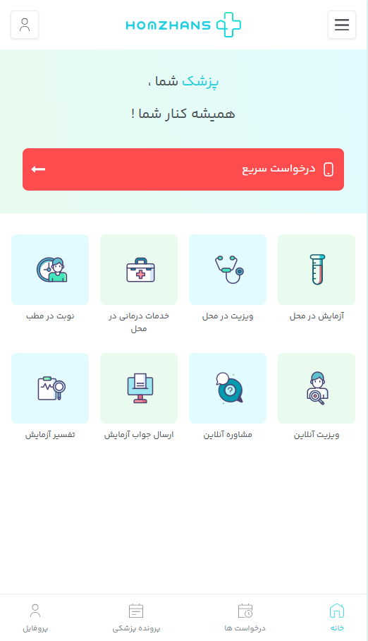
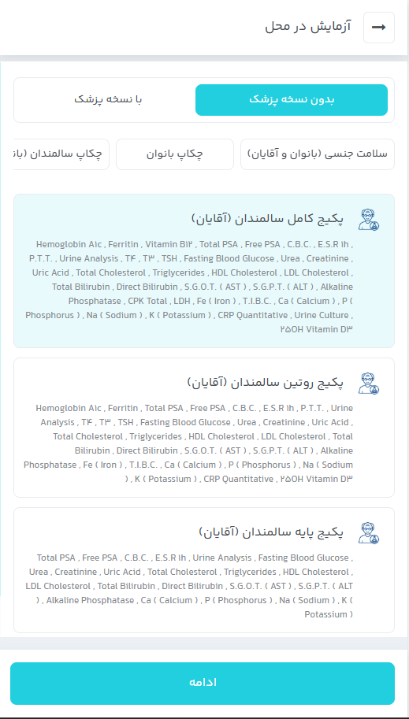
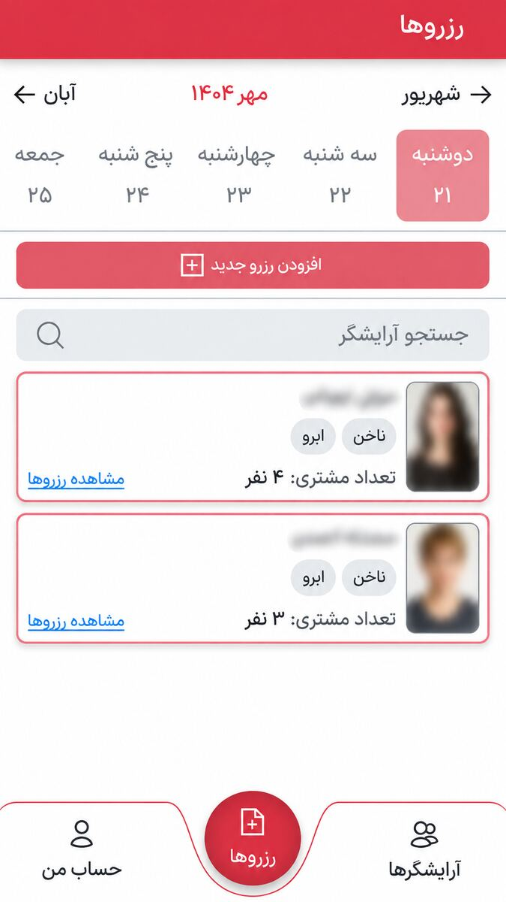
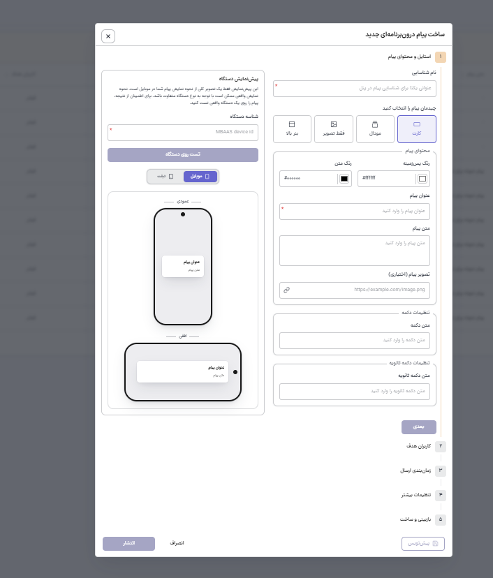
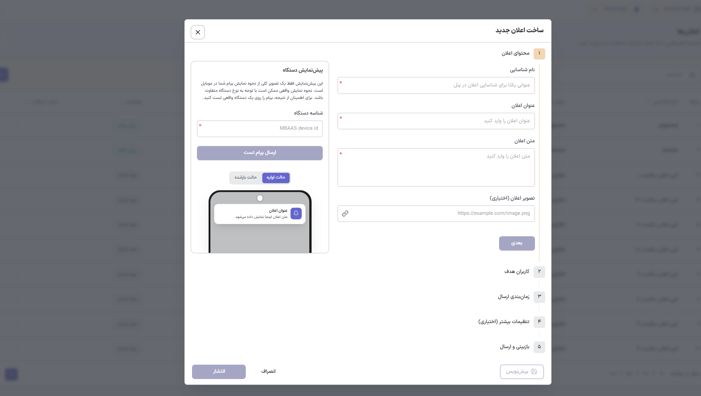
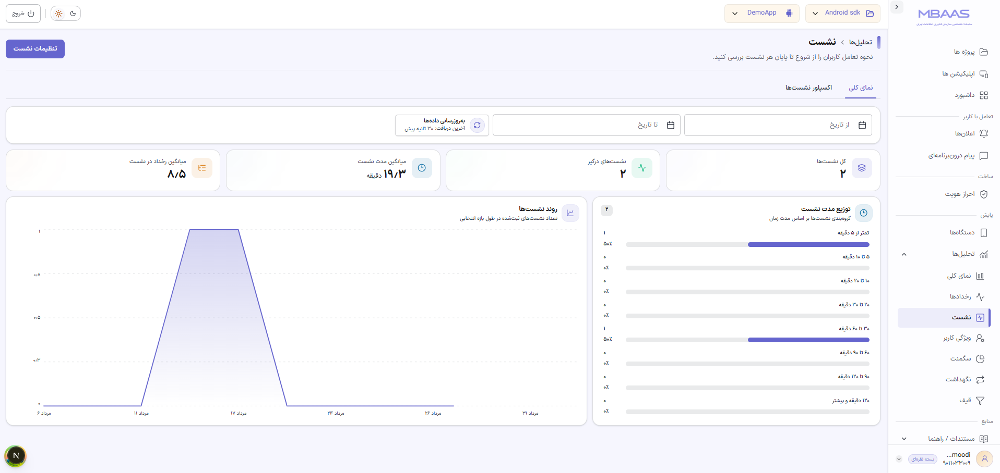
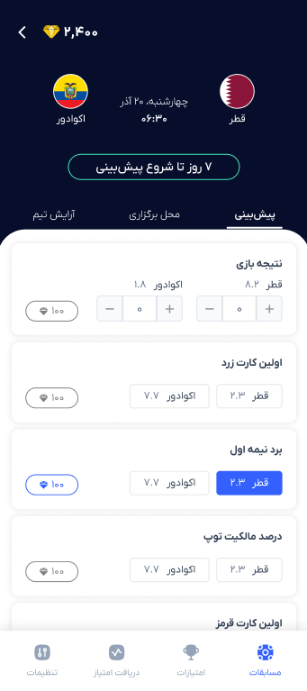
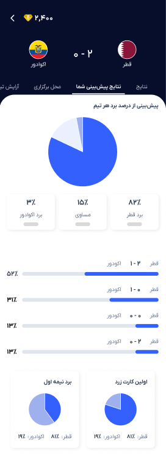
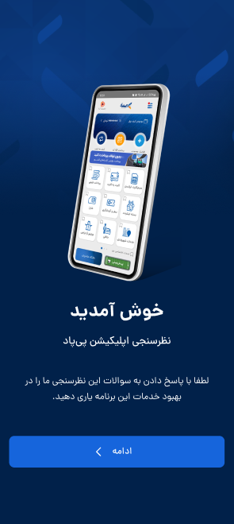
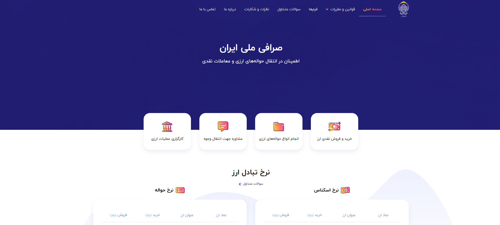

# Hi, I'm Ali Mahmoodi 👋

### Senior Front-End Developer · Front-End Lead

I build maintainable, user-focused web products and enterprise front-end applications with React, Next.js, TypeScript, and modern UI architecture.

My experience includes multi-role dashboards, banking and fintech services, healthcare platforms, booking systems, complex forms, API integrations, reusable component systems, and technical leadership for front-end teams.

## Core expertise

- React and Next.js
- TypeScript and JavaScript
- Tailwind CSS and reusable component architecture
- TanStack React Query, Zustand, Redux/Thunk, and Axios
- Enterprise dashboards and multi-role workflows
- Forms, validation, OTP, permissions, and API integration
- Front-end architecture, code review, mentoring, and team leadership
- Practical Node.js, Express, Prisma, PostgreSQL, and MySQL familiarity
- AI-assisted development with Codex, Claude Code, Cursor, and GitHub Copilot

## Selected public product references

These links show products I have worked on. The source code for company-owned projects is not published.

- [HomZhans](https://homzhans.com/) — Healthcare services platform
- [Merci Booking](https://mercibooking.com/) — Beauty service booking platform
- [Melli Exchange](https://www.mex.co.ir/) — Currency exchange services
- [Day Exchange](https://dayexc.ir/) — Exchange services platform

## Portfolio snapshots

Representative interface screens from selected professional work. These images are shared for portfolio purposes only; proprietary source code, private repositories, client data, and confidential company information are not included.

### HomZhans — Healthcare Services Platform

  
  

[View the HomZhans product](https://homzhans.com/) · [Portfolio details](./PORTFOLIO.md#homzhans)

### Merci Booking — Salon Appointment Platform

  
  

[View the Merci Booking product](https://mercibooking.com/) · [Portfolio details](./PORTFOLIO.md#merci-booking)

### Enterprise Platforms

  
  
  

  
  
  

[View portfolio details](./PORTFOLIO.md#enterprise-platforms)

### Exchange Platforms

  
  

[View Melli Exchange](https://www.mex.co.ir/) · [View Day Exchange](https://dayexc.ir/)

## Resume

- [English resume repository](https://github.com/rminmh/ali-mahmoodi-resume)
- [English resume — Markdown](https://github.com/rminmh/ali-mahmoodi-resume/blob/main/Ali-Mahmoodi-Resume-en.md)
- [English resume — PDF](https://github.com/rminmh/ali-mahmoodi-resume/blob/main/Ali-Mahmoodi-Resume-en.pdf)

## Connect

- [LinkedIn](https://www.linkedin.com/in/alii-mahmoodi/)
- [GitHub](https://github.com/rminmh)

> This profile contains public professional information only. Proprietary source code, private repositories, client data, and confidential company information are not included.
